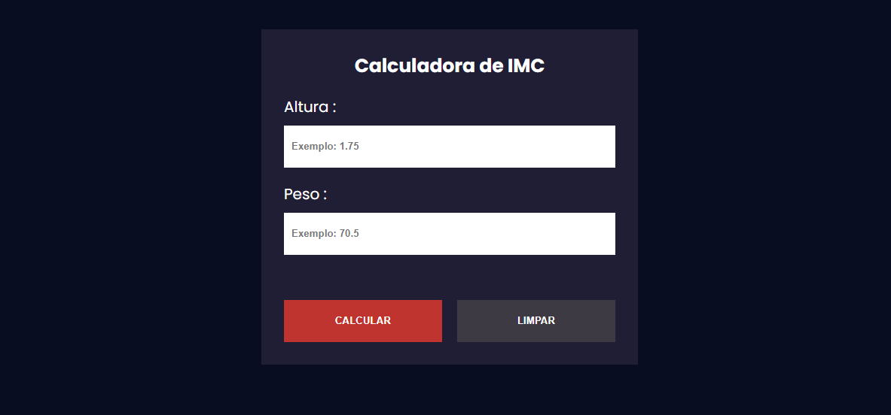
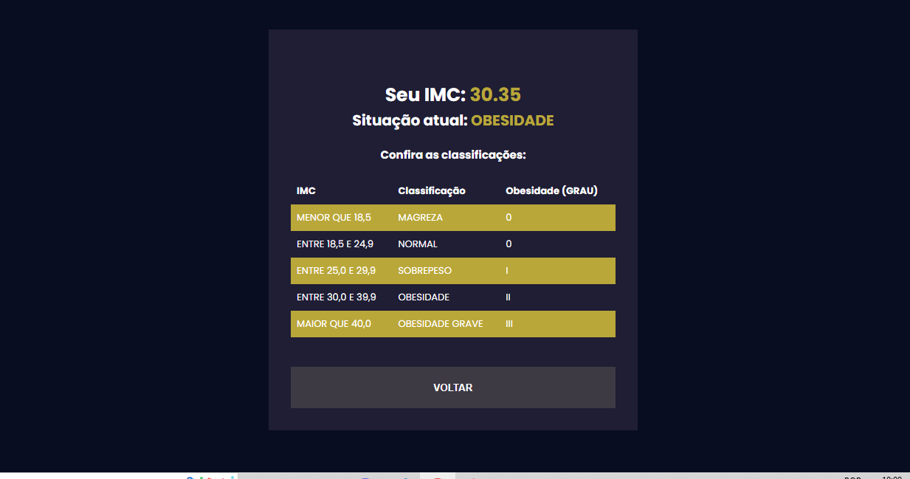

## 🚀 Technologies :

**Front-end:** HTML5, CSS3 and JAVASCRIPT;

## 👩‍💻 Functionalities:

- Perform BMI calculation with weight and height information

## 💻 How to use :

Project Link : https://project-calculator-imc.vercel.app/

## 👨 Author :

[@jhonathanSousa](https://www.linkedin.com/in/jhonathan-alves-sousa/)